**POLICY PULSE**

*Kubernetes Security Observability and Policy Enforcement Platform*

Design & Implementation

and Evaluation of a Cloud-Native Security Platform

**Module: DevOps & Security**

**By**

> Adekanye Victor
>
> Adetunji Kehinde
>
> Anastasiia Malova

16^th^ March, 2026

# Abstract

The rapid adoption of Kubernetes as a container orchestration platform has introduced significant security challenges for organizations managing cloud-native infrastructure. Misconfigurations, excessive container privileges, and insufficient monitoring can result in Distributed Denial of Service Attacks (DDOS), privilege escalations, and large attack surface areas when a cluster is attacked. Traditional security tools often struggle to effectively detect and mitigate these large-scale, distributed attacks within dynamic Kubernetes environments.

This report presents Policy-as-Code, a comprehensive Kubernetes security observability and policy enforcement platform developed as part of the DevOps and Security module. The project integrates five distinct security layers: Kyverno policy-as-code enforcement for admission-time workload validation; an ELK-style logging pipeline (Fluent Bit, Elasticsearch, Kibana) for centralized security event aggregation and visualization; a DeepSeek API-powered AI dashboard for automated security analysis and recommendations; Trivy and Kubescape vulnerability and compliance scanning; and a GitLab CI/CD pipeline automating the entire build-scan-test-deploy lifecycle.

The project was deployed across a multi-namespace Kubernetes cluster on AWS infrastructure, with policy enforcement selectively applied through namespace labels. Five Kyverno policies successfully enforced non-root execution, read-only filesystems, resource limits, privilege restrictions, and image tag controls across application namespaces. The CI/CD pipeline produced downloadable Trivy vulnerability reports and Kubescape compliance assessments as pipeline artifacts on every commit.

# 

# 1. Introduction

## 1.1 Background

Kubernetes clusters deployed without automated policy enforcement are susceptible to a range of security anti-patterns. Containers running as the root user can escalate privileges to the host node. Images tagged with :latest lack version pinning, making deployments non-reproducible and vulnerable to supply chain attacks. Containers without resource limits can consume all available node resources, creating denial-of-service conditions. Writable root file systems enable attackers to modify container binaries at runtime.

Furthermore, the absence of centralized logging for policy violations means that security events are scattered across individual pod logs, making it impractical for operators to identify patterns, track compliance drift, or respond to emerging threats in a timely manner. Manual security reviews do not scale with the pace of continuous delivery pipelines that may deploy dozens of changes per day.

The problem this project addresses is threefold: how to enforce security policies consistently across multiple Kubernetes workloads, how to aggregate and visualize security events for actionable observability, and how to integrate security scanning into the automated delivery pipeline without impeding development velocity.

## 1.2 Aims and Objectives

The primary aim of this project is to design, implement, and evaluate a Kubernetes security observability platform that integrates policy enforcement, centralized logging, AI-driven analysis, and automated CI/CD deployment into a cohesive system.

The specific objectives are as follows:

1.  Design and implement five Kyverno ClusterPolicies enforcing container security standards: non-root execution, read-only root filesystems, resource limits, privilege restrictions, and explicit image tagging.

2.  Deploy an ELK-style logging pipeline using Fluent Bit as the log collector, Elasticsearch as the indexing engine, and Kibana as the visualization layer, with a custom Policy Report Exporter bridging Kyverno data into Elasticsearch.

3.  Develop a Flask-based AI dashboard (PolicyPulse AI) that leverages the DeepSeek API to perform automated policy analysis, pod health anomaly detection, and deployment configuration security auditing.

4.  Construct a four-stage GitLab CI/CD pipeline incorporating Docker image builds, Trivy vulnerability scanning, Kubescape NSA/MITRE compliance assessment, Python unit testing, and SSH-based deployment to a production server.

5.  Evaluate platform effectiveness through Kubescape compliance scores, Trivy vulnerability counts, Kyverno policy violation metrics, and qualitative assessment of AI-generated recommendations.

6.  Document challenges encountered during implementation and provide recommendations for future enhancements.

## 1.3 Scope and Boundaries

The platform targets a Minikube-based Kubernetes environment deployed on AWS EC2 Ubuntu instances. The development environment runs on a dedicated server (st1) hosting the GitLab instance and CI runner, while production deployment utilizes a separate AWS instance. The scope encompasses five Kyverno security policies, a complete Fluent Bit to Elasticsearch logging pipeline, a four-panel Kibana security dashboard, a multi-endpoint Flask AI analysis application, and a fully automated GitLab CI/CD pipeline.

The project does not cover multi-node Kubernetes clusters, runtime security monitoring (e.g., Falco), service mesh implementations (e.g., Istio), or production-grade high availability configurations. Elasticsearch RBAC (X-Pack Security) was evaluated during the project but ultimately deferred due to infrastructure constraints, and the rationale for this decision is documented in the Discussion section.

# 2. Methodology

## 2.1 Development Approach

The project followed an iterative development methodology, with each component built, tested, and integrated incrementally. Development proceeded through four phases: infrastructure provisioning and Kyverno policy authoring; logging pipeline construction and Kibana dashboard creation; AI dashboard development and deployment; and CI/CD pipeline construction with security scanning integration.

Version control was managed through a GitLab repository (policyascode) with commits reflecting incremental feature additions. Debugging followed a systematic pipeline-tracing approach, particularly for the Fluent Bit to Elasticsearch data flow, where each stage was verified independently before diagnosing integration failures.

## 2.2 Infrastructure Architecture

The platform architecture spans three physical servers and four Kubernetes namespaces. The development server (st1) hosts the self-managed GitLab instance and the GitLab CI runner configured with a shell executor. The production server is an AWS EC2 instance running Ubuntu 24.04 with Minikube, Docker, Helm, kubectl, and Kyverno installed. Docker Hub serves as the container image registry.

### 2.2.1 System Architecture Diagram

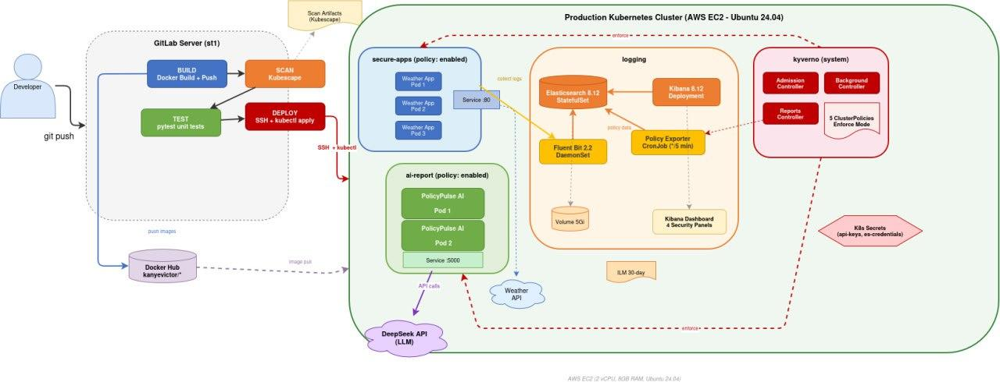

### Figure 1: *PolicyPulse Complete System Architecture*

# Project Directory Structure

> **policyascode/**
>
> **├── .gitlab-ci.yml**
>
> **├── app/**
>
> **│ ├── app.py**
>
> **│ ├── Dockerfile**
>
> **│ ├── requirements.txt**
>
> **│ ├── test_app.py**
>
> **│ └── templates/index.html**
>
> **├── k8s/**
>
> **│ ├── elasticsearch/**
>
> **│ │ ├── es-service.yaml**
>
> **│ │ └── es-statefulset.yaml**
>
> **│ ├── fluent-bit/**
>
> **│ │ ├── fluent-bit-cm.yaml**
>
> **│ │ ├── fluent-bit-ds.yaml**
>
> **│ │ └── fluent-bit-sa.yaml**
>
> **│ ├── kibana/**
>
> **│ │ └── kibana-deployment.yaml**
>
> **│ ├── policypulse-ai/**
>
> **│ │ ├── app.py**
>
> **│ │ ├── Dockerfile**
>
> **│ │ ├── policypulse-ai-deployment.yaml**
>
> **│ │ ├── requirements.txt**
>
> **│ │ └── templates/index.html**
>
> **│ ├── namespace.yaml**
>
> **│ ├── policy-reporter.yaml**
>
> **│ ├── secrets.yaml**
>
> **│ └── kyverno-values.yaml**
>
> **├── manifests/**
>
> **│ ├── weather-app-deployment.yaml**
>
> **│ ├── test-good.yaml**
>
> **│ └── test-bad.yaml**
>
> **├── policies/**
>
> **│ ├── disallow-latest-tag.yaml**
>
> **│ ├── disallow-privileged.yaml**
>
> **│ ├── require-non-root.yaml**
>
> **│ ├── require-readonly-rootfs.yaml**
>
> **│ └── require-resource-limits.yaml**
>
> **└── requirements.txt**

### 2.2.2 Technology Stack

  ------------------------------------------------------------------------------------------------------
  **Layer**            **Technology**           **Purpose**
  -------------------- ------------------------ --------------------------------------------------------
  Orchestration        Minikube / Kubernetes    Container orchestration and cluster management

  Policy Engine        Kyverno                  Admission control, background scanning, policy reports

  Log Collection       Fluent Bit               Container log tailing, enrichment, and forwarding

  Log Storage          Elasticsearch            Full-text indexing, search, and log retention

  Visualization        Kibana                   Dashboard creation and log exploration

  AI/LLM Backend       DeepSeek API             Natural language security analysis

  App Framework        Flask + Gunicorn         AI dashboard web server

  Image Scanning       Trivy                    CVE detection in images and manifests

  Compliance Scan      Kubescape                NSA-CISA and MITRE ATT&CK assessment

  CI/CD                GitLab CI                Pipeline automation with artifact generation

  Registry             Docker Hub               Container image storage (kanyevictor/\*)

  Infrastructure       AWS EC2 Ubuntu           Production and CI runner hosting
  ------------------------------------------------------------------------------------------------------

### 2.2.3 Namespace Design and Policy Scoping

A namespace isolation strategy was used to separate the application workloads from infrastructure components. Each namespace carries a policy-enforcement label that determines whether Kyverno admission policies are applied:

  -----------------------------------------------------------------------------------------------------------------------------------
  **Namespace**   **Purpose**                    **Policy Label**   **Components**
  --------------- ------------------------------ ------------------ -----------------------------------------------------------------
  secure-apps     Application workloads          enabled            Weather App (3 replicas)

  AI report       AI analysis dashboard          enabled            PolicyPulse AI (1 replica)

  logging         Observability infrastructure   disabled           Elasticsearch, Fluent Bit, Kibana, Policy Exporter

  kyverno         Policy engine (system)         N/A (excluded)     Admission Controller, Background Controller, Reports Controller
  -----------------------------------------------------------------------------------------------------------------------------------

This design was driven by a practical constraint discovered during implementation where third-party infrastructure tools such as Elasticsearch and Kibana require root filesystem access and elevated privileges that conflict with strict security policies. Rather than weakening policies globally, the namespace label approach allows the preservation while maintaining full enforcement on the application workloads also permitting infrastructure flexibility.

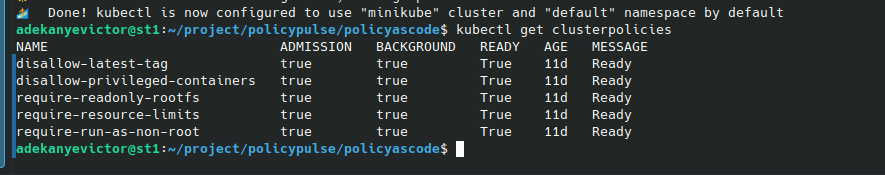

## 2.3 Policy-as-Code Implementation

Kyverno was selected as the policy engine for several reasons. Unlike Open Policy Agent (OPA) with Gatekeeper, which requires learning the Rego query language, Kyverno policies are expressed in native Kubernetes YAML, making it easier for DevOps teams already familiar with Kubernetes manifests.

### 2.3.1 Policy Catalogue

Five ClusterPolicies were authored, each targeting a specific container security control from established hardening guidelines:

  ---------------------------------------------------------------------------------------------------------------------------------------------------------
  **Policy**                       **Rule Name**           **Enforcement**   **Security Control**
  -------------------------------- ----------------------- ----------------- ------------------------------------------------------------------------------
  disallow-latest-tag              validate-image-tag      Enforce           Blocks the :latest tag to ensure image provenance and reproducibility

  disallow-privileged-containers   check-privileged        Enforce           Rejects containers with privileged: true to prevent host-level access

  require-run-as-non-root          check-run-as-non-root   Enforce           Mandates runAsNonRoot: true to limit container capabilities

  require-readonly-rootfs          check-readonly-rootfs   Enforce           Requires readOnlyRootFilesystem: true to prevent runtime binary modification

  require-resource-limits          check-resource-limits   Enforce           Enforces CPU and memory limits to prevent resource exhaustion attacks
  ---------------------------------------------------------------------------------------------------------------------------------------------------------

Each policy uses a namespace. Selector with matchLabels to restrict enforcement to namespaces carrying the policy-enforcement: enabled label. This mechanism ensures that infrastructure components in the logging namespace, which require elevated privileges and writable file systems, are not blocked by admission policies.

**2.3.2 Policy YAML Structure**

The following illustrates the structure of the disallow-latest-tag policy, representative of all five policies in the catalogue:

> **apiVersion: kyverno.io/v1**
>
> **kind: ClusterPolicy**
>
> **metadata:**
>
> **name: disallow-latest-tag**
>
> **spec:**
>
> **validationFailureAction: Enforce**
>
> **rules:**
>
> **- name: validate-image-tag**
>
> **match:**
>
> **any:**
>
> **- resources:**
>
> **kinds:**
>
> **- Pod**
>
> **namespaceSelector:**
>
> **matchLabels:**
>
> **policy-enforcement: enabled**
>
> **validate:**
>
> **pattern:**
>
> **spec:**
>
> **containers:**
>
> **- image: \"!\*:latest\"**

**Figure 3:** *Kyverno ClusterPolicies Listed in the Cluster*

### 2.3.3 Policy Validation Testing

Two test manifests were developed to validate policy enforcement behaviour. The compliant manifest (test-good.yaml) is a pod with explicit image tags, non-root execution, read-only root filesystem, resource limits, and no privileged access. The non-compliant manifest (test-bad.yaml) deliberately violates all five policies by using :latest tags, running as root, enabling privileged mode, omitting resource limits, and using a writable filesystem.

When applied to the secure-apps namespace, the compliant manifest was accepted by the admission controller, and the pod reached Running status. The non-compliant manifest was rejected with detailed violation messages identifying each policy breach and the specific YAML path that triggered the failure.

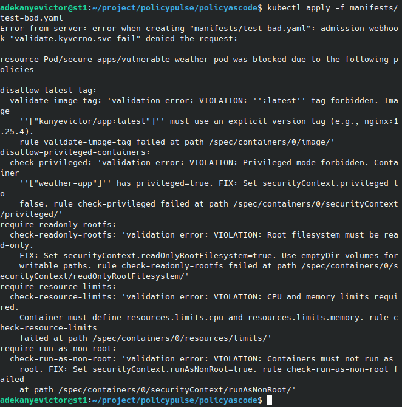

**Figure 4:** *Kyverno Blocking a Non-Compliant Pod with Detailed Violation Messages*

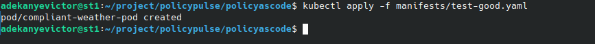

**Figure 5:** *Compliant Pod Successfully Deployed and Running*

## 2.4 Logging and Observability Pipeline

Centralized logging is a foundational requirement for security observability in distributed systems. In a Kubernetes environment where containers are ephemeral and may be terminated at any moment, relying on local container logs for security investigation is impractical. The observability pipeline in PolicyPulse addresses this by collecting, enriching, filtering, and indexing container logs and policy violation data into a persistent, searchable store.

### 2.4.1 Pipeline Architecture

The logging pipeline follows a four-stage architecture:

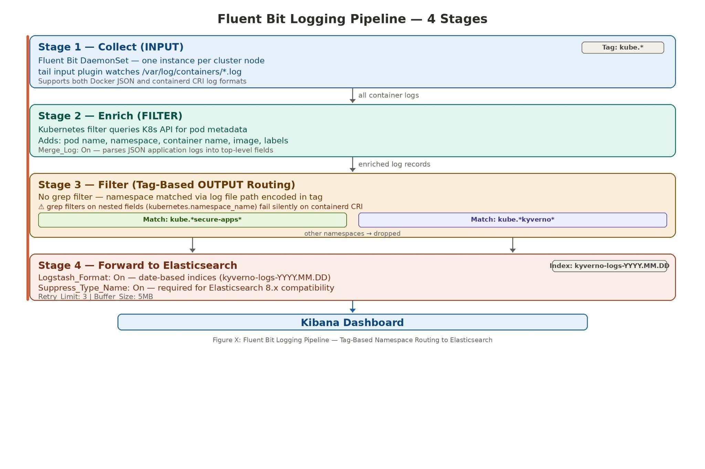

**Figure 6:** *Fluent Bit Log Processing Pipeline Architecture*

### 

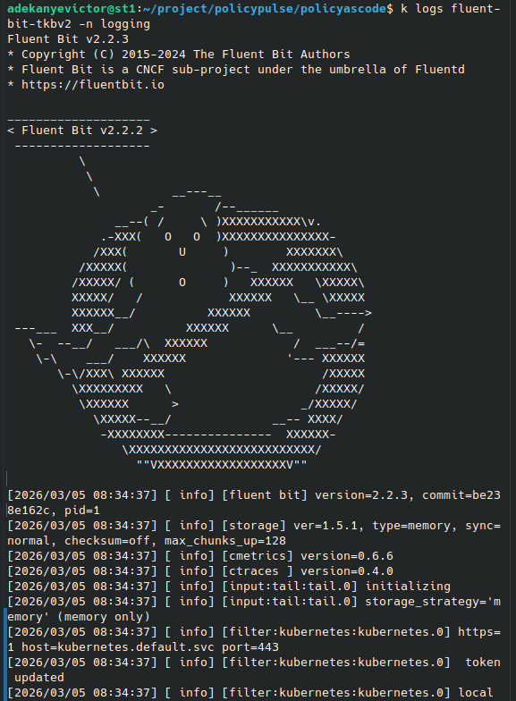

**Figure 7:** *Fluent Bit Installation*

### 2.4.2 Policy Report Exporter

Kyverno stores policy evaluation results as PolicyReport custom resources within the Kubernetes API, not as container logs. This means Fluent Bit cannot natively collect policy violation data. To bridge this observability gap, a custom CronJob was developed that runs every five minutes to:

1.  Query the Kubernetes API for all PolicyReport resources across namespaces.

2.  Extract individual policy check results, including the policy name, rule name, result (pass/fail), severity, violation message, target resource, and timestamp.

3.  Transform each result into a structured JSON document with an \@timestamp field for time-series indexing.

4.  POST each document to the Elasticsearch kyverno-logs-{date} index via the REST API.

The exporter runs as a Python 3.11 Alpine container with a Kubernetes ServiceAccount granted ClusterRole permissions for get and list operations on PolicyReports and ClusterPolicyReports.

## 2.5 Kibana Security Dashboard

A four-panel security dashboard named PolicyPulse Security Dashboard was constructed in Kibana to provide at-a-glance visibility into the cluster security posture. The dashboard operates on the kyverno-logs-\* data view with \@timestamp as the time field.

  -------------------------------------------------------------------------------------------------------------------------------------------------------------------------
  **Panel**              **Visualization Type**   **Configuration**                                                 **Purpose**
  ---------------------- ------------------------ ----------------------------------------------------------------- -------------------------------------------------------
  Total Violations       Metric (Lens)            Count of records, filter: result=fail                             Single-number display of total policy violations

  Violation Timeline     Bar Chart (Lens)         X: \@timestamp (auto), Y: count                                   Temporal distribution of violation events

  Violations by Policy   Donut Chart (Lens)       Slice by: policy_name.keyword                                     Proportional breakdown of which policies trigger most

  Violation Details      Data Table (Lens)        Columns: \@timestamp, namespace, policy_name, severity, message   Drill-down table for individual violation records
  -------------------------------------------------------------------------------------------------------------------------------------------------------------------------

The dashboard recorded 932 total policy checks at the time of evaluation, with violations concentrated in the kube-system and logging namespaces, where third-party infrastructure components lack strict security contexts. Application workloads in the secure-apps namespace showed zero violations, confirming policy compliance.

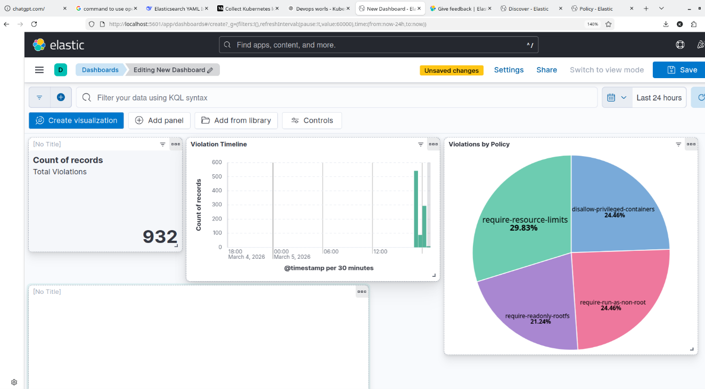

**Figure 8:** *PolicyPulse Security Dashboard in Kibana*

## During dashboard validation, it was observed that the Enforce mode configuration of Kyverno ClusterPolicies prevented non-compliant pods from being admitted to the cluster, meaning that policy violation records (result: fail) were not generated for blocked resources. This is the intended behaviour of Enforce mode, as it provides preventative security rather than detective security. 

## Consequently, the dashboard was reconfigured to display all policy evaluation results, providing continuous evidence that Kyverno is actively scanning running workloads against the five ClusterPolicies. The Total Policy Evaluations metric, Policy Evaluation Distribution chart, and Evaluation Timeline collectively demonstrate that all admitted workloads achieve 100% compliance, while the terminal-level admission rejection messages (as shown in Figure 9) serve as evidence that non-compliant deployments are blocked in real time. 

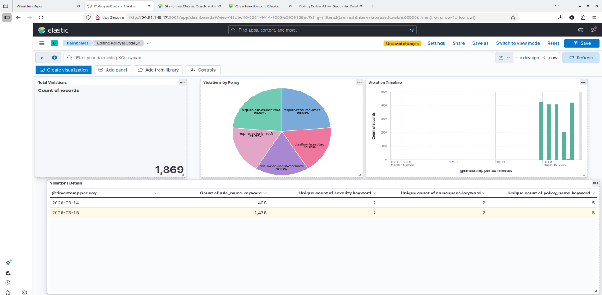

## Figure 9: *PolicyPulse Evaluation Dashboard in Kibana*

## 2.6 AI-Powered Security Analysis Dashboard

The PolicyPulse AI component extends the project beyond rule-based detection into the domain of intelligent security analysis. It was deployed as a Flask web application in the ai-report namespace, allowing it to interface with the DeepSeek API (an OpenAI-compatible LLM endpoint) to perform analysis on live cluster data.

The application collects live cluster data by executing kubectl commands via subprocess calls, authenticated through the pod ServiceAccount token. A ClusterRole grants read-only access to pods, events, namespaces, deployments, PolicyReports, and ClusterPolicies. All DeepSeek API responses are parsed as JSON, with fallback handling for suspicious activity on the pods.

The AI dashboard deployment itself follows the security best practices enforced by Kyverno:

-   Non-root execution: runAsUser: 1000, runAsNonRoot: true

-   Read-only root filesystem: readOnly RootFilesystem: true with an empty Dir volume at /tmp

-   No privilege escalation: privileged: false

-   Resource limits: CPU 500m, memory 256 Mi

-   Explicit image tagging: kanyevictor/policypulse-ai:v{tag}

-   The API key is stored as a Kubernetes Secret and injected via an environment variable.

The first initial scan of the cluster by the application gave a score of 42/100, as shown in Figure 10 described below. The results included the absence of resource limitations, writable root file systems, containers operating in privileged mode, and missing runAsNonRoot requirements. The deployment of PolicyPulse AI and the kube-system infrastructure components were the main areas impacted by these findings.

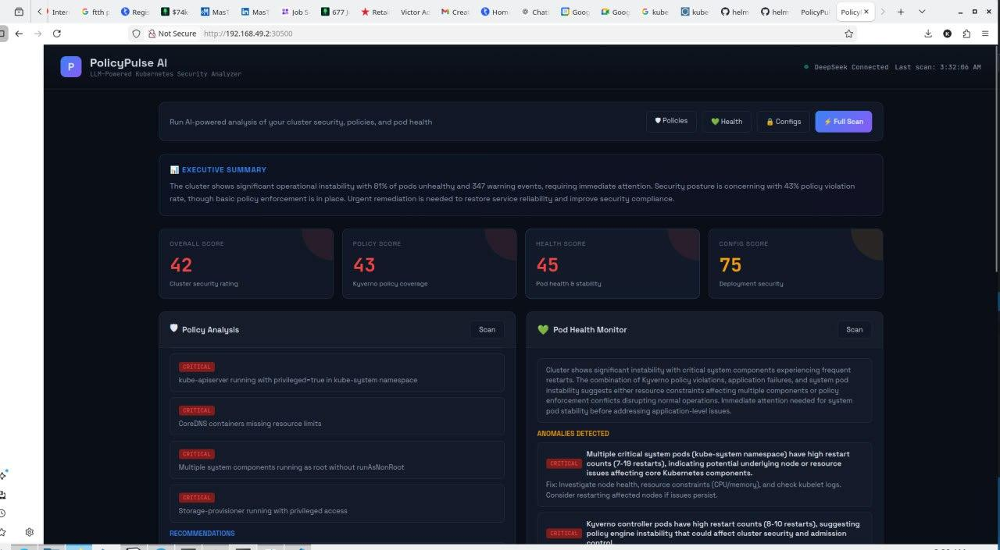

**Figure 10:** *PolicyPulse AI Dashboard with Security Analysis Results*

To fix the issues recommended by the agent, the hardening involved setting the temporary directory environment variable to fix Python tempfile discovery failures on read-only filesystems.

enforcing versioned image tags, adding empty Dir volumes for writable temporary paths needed by Gunicorn, and hardening the context (runAsNonRoot, readOnlyRootFilesystem, allowPrivilegeEscalation: false).

A better overall score of 78/100 was obtained from a second scan, as shown in Figure 11, with the Policy Score increasing from 43 to 85 and the Config Score from 75 to 80. The remaining deductions can be attributed to the components of the Kube system (kube-apiserver, etcd, kube-proxy) that require privileged access by design and cannot be hardened without breaking cluster functionality.

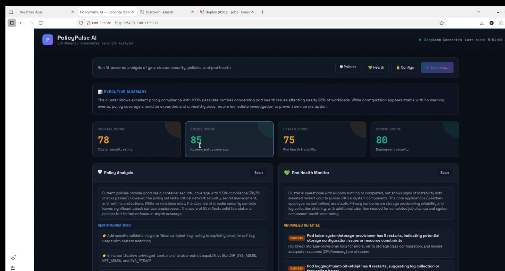

**Figure 10:** *PolicyPulse AI Dashboard after fixing security issues*

## 2.7 CI/CD Pipeline

Continuous integration and continuous deployment form the operational backbone of the PolicyPulse delivery lifecycle. A four-stage GitLab CI pipeline automates the progression from code commit to production deployment, with security scanning integrated as a first-class concern at the scan stage.

### 2.7.1 Pipeline Architecture

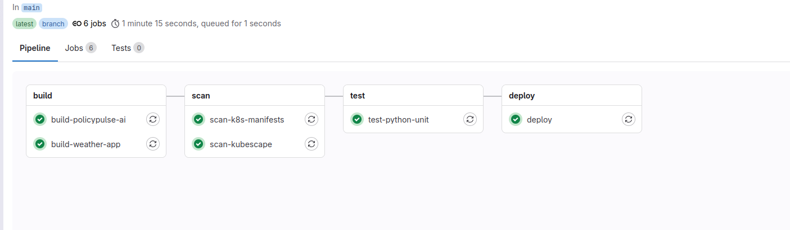

**Figure 12:** *Complete GitLab CI/CD Pipeline Execution*

  ----------------------------------------------------------------------------------------------------------------------------
  **Stage**   **Jobs**                                  **Tool**        **Output**
  ----------- ----------------------------------------- --------------- ------------------------------------------------------
  Build       build-weather-app, build-policypulse-ai   Docker          Tagged images pushed to Docker Hub (v{pipeline_iid})

  Scan        scan-weather-app, scan-policypulse-ai     Trivy           Vulnerability reports (TXT + JSON artifacts)

  Scan        scan-k8s-manifests                        Trivy config    Manifest misconfiguration reports

  Scan        scan-kubescape                            Kubescape       NSA-CISA and MITRE ATT&CK compliance reports

  Test        test-python-unit                          pytest          Unit test results

  Deploy      deploy                                    SSH + kubectl   Production deployment with rollout status
  ----------------------------------------------------------------------------------------------------------------------------

### 2.7.2 Shell Executor Configuration

The GitLab runner operates with a shell executor rather than a Docker executor, meaning all pipeline tools execute directly on the runner host. This architectural decision was necessitated by the existing infrastructure configuration and has specific implications: Image: Directives in the pipeline YAML are ignored, and all required tools (Docker, Trivy, Kubescape, Python, and pytest) must be pre-installed on the runner machine.

This approach offers performance advantages but requires careful dependency management on the runner host.

### 2.7.3 Security Scanning Integration

Two complementary scanning tools provide layered security assessment:

**Trivy** performs image vulnerability scanning against the National Vulnerability Database, identifying CVEs in both OS packages and application dependencies. It also scans Kubernetes manifests for misconfigurations using built-in checks. Scan results are saved as downloadable artifacts in both human-readable (TXT) and machine-parseable (JSON) formats, which were attached to the report.

**Kubescape** evaluates manifests against the NSA-CISA Kubernetes Hardening Guide and the MITRE ATT&CK framework for containers. It produces per-control pass/fail assessments with compliance percentage scores, identifying specific YAML paths that require remediation.

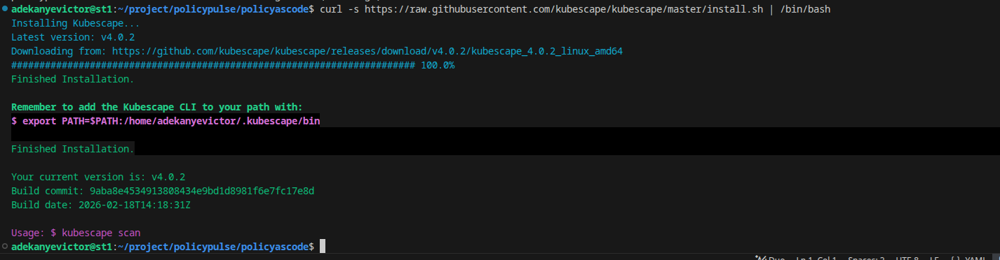

**Figure 13:** *Installation of Kubescape on the GitLab runner*

### 2.7.4 Deployment Strategy

The deploy stage executes on the main branch and performs the following sequence:

1.  Updates image tags in deployment manifests using sed on the runner, replacing hardcoded versions with the pipeline-generated tag (v{CI_PIPELINE_IID}).

2.  Changes imagePullPolicy from Never (used in local Minikube development) to Always (required for production Docker Hub pulls).

3.  Creates target directories on the production server via SSH.

4.  Copies all Kubernetes manifests, policy files, and deployment configurations to the production server via SCP.

5.  Applies resources sequentially via individual SSH commands, each suffixed with \|\| true to prevent Kyverno enforcement rejections from halting the pipeline.

6.  Monitors rollout status for the weather app and PolicyPulse AI deployments.

7.  Outputs a deployment summary showing pod status across all namespaces.

SSH authentication between the GitLab runner and production server was established using Ed25519 key pairs, with the gitlab-runner system user key distributed to the production server authorized_keys file.

# 

# 

# 

# 

# 

# 3. Results

## 3.1 Policy Enforcement Results

Kyverno successfully enforced all five ClusterPolicies on namespaces carrying the policy-enforcement: enabled label. The admission controller demonstrated consistent behaviour across repeated deployments, correctly accepting compliant workloads and rejecting non-compliant ones.

  -----------------------------------------------------------------------------------------------------------------
  **Test Case**                     **Namespace**   **Expected**          **Actual**   **Policies Triggered**
  --------------------------------- --------------- --------------------- ------------ ----------------------------
  test-good. YAML (compliant pod)   secure-apps     Accepted              Accepted     0 violations

  test-bad.yaml (all violations)    secure-apps     Rejected              Rejected     5/5 policies triggered

  weather-app deployment            secure-apps     Accepted              Accepted     0 violations

  PolicyPulse-AI deployment         AI report       Accepted              Accepted     0 violations

  Elasticsearch stateful set        logging         Accepted (excluded)   Accepted     N/A (enforcement disabled)

  Kibana deployment                 logging         Accepted (excluded)   Accepted     N/A (enforcement disabled)
  -----------------------------------------------------------------------------------------------------------------

The PolicyReport data indexed into Elasticsearch recorded 932 total policy evaluation results across all cluster resources. Violations were concentrated in the kube-system and logging namespaces, where system components and third-party infrastructure operate without strict security contexts. Resources in the secure-apps and ai-report namespaces achieved full compliance across all five policies.

The non-compliant test manifest (test-bad.yaml) triggered detailed rejection messages identifying each violation type, the specific YAML path that failed validation, and remediation guidance embedded in the policy message field.

## 3.2 Kubescape Compliance Results

Kubescape assessed the platform against two industry-standard security frameworks:

  ------------------------------------------------------------------------------------------------
  **Assessment**     **Framework**   **Controls**   **Passed**   **Failed**   **Compliance**
  ------------------ --------------- -------------- ------------ ------------ --------------------
  Static manifests   NSA-CISA        20             9            11           67.68%

  Static manifests   MITRE ATT&CK    20             9            11           67.68%

  Live cluster       NSA-CISA        26             8            14           86.18%
  ------------------------------------------------------------------------------------------------

### 

### 3.3.1 Passed Controls

-   C-0002: Prevent containers from allowing command execution (100%)

-   C-0035: Administrative Roles restriction (100%)

-   C-0038: Host PID/IPC privileges blocked (100%)

-   C-0041: HostNetwork access prevented (100%)

-   C-0044: Container hostPort restricted (100%)

-   C-0046: Insecure capabilities blocked (100%)

-   C-0057: Privileged container restriction (87.5%)

-   C-0270: CPU limits enforced (75%)

-   C-0271: Memory limits enforced (75%)

### 3.3.2 Failed Controls

-   C-0013: Non-root containers (0%---missing runAsGroup on all resources)

-   C-0030: Ingress/Egress network policies (0%---no NetworkPolicy resources defined)

-   C-0055: Linux hardening (0%---missing seccompProfile, capabilities). drop, and seLinuxOptions)

-   C-0054: Cluster internal networking (0%---no network segmentation)

-   C-0016: Allow privilege escalation (25%---missing allowPrivilegeEscalation: false on infrastructure)

-   C-0034: Automatic service account mapping (64%---automountServiceAccountToken not disabled)

-   C-0017: Immutable container filesystem (38%---logging components need writable FS)

-   C-0012: Credentials in configuration (90%---the policy exporter ConfigMap contains an API token reference)

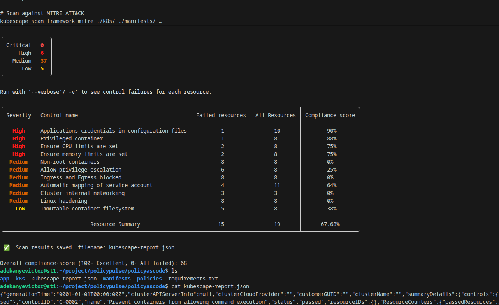

**Figure 14:** *Kubescape NSA-CISA Compliance Assessment Summary*

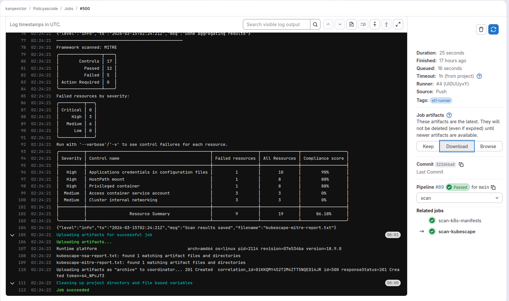

**Figure 15:** *Kubescape MITRE ATT&CK Framework Assessment Results*

## 3.4 AI Analysis Results

The PolicyPulse AI dashboard successfully collected live cluster data and generated structured security analysis via the DeepSeek API. The full scan endpoint returned an executive summary synthesizing findings across all three analysis categories.

Policy analysis identified the active policies, quantified pass/fail rates from policy reports, and recommended additional policies for network segmentation, pod disruption budgets, and image registry whitelisting. Health monitoring detected pod restart anomalies and correlated them with warning events. Configuration scanning identified specific deployment-level security gaps, including missing capabilities. drop and seccompProfile settings.

**Figure 16:** *PolicyPulse AI Full Security Scan Results*

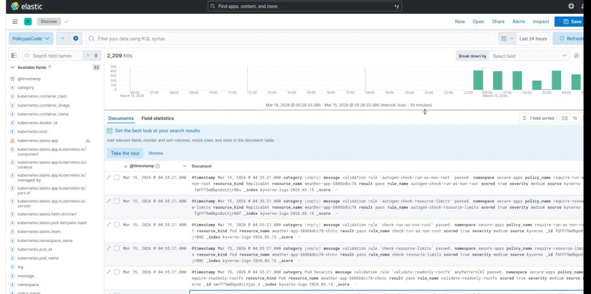

**Figure 17:** Logs displayed on Elasticsearch

## 3.5 CI/CD Pipeline Results

The pipeline executed successfully across all four stages on every push to the main branch. Build jobs produced Docker images with auto-incrementing tags (v1, v2, \..., v19, etc.) pushed to Docker Hub. Scan jobs generated downloadable artifacts containing Trivy vulnerability reports and Kubescape compliance assessments. Test jobs validated application functionality through pytest unit tests. The deploy stage successfully applied all compliant Kubernetes resources to the production cluster.

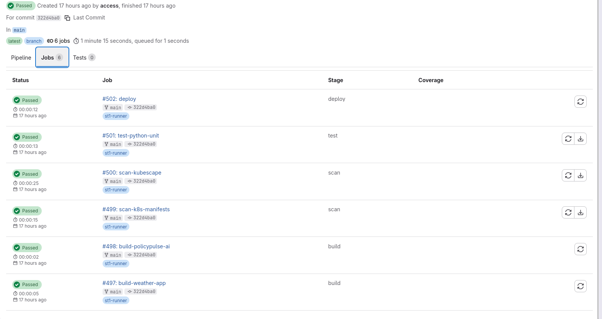

**Figure 18:** Successful deployment of the stages

**3.6 Production Deployment Results**

The production AWS EC2 instance (2 CPU, 8 GB RAM, Ubuntu 24.04) successfully hosted the Minikube cluster with the following components operational:

  --------------------------------------------------------------------------------------------------
  **Component**              **Namespace**   **Status**                    **Access Method**
  -------------------------- --------------- ----------------------------- -------------------------
  Weather App (3 replicas)   secure-apps     Running                       Port forward 8080:80

  PolicyPulse AI             AI report       Running                       Port forward 5000:5000

  Elasticsearch              logging         Running (after inotify fix)   Internal cluster access

  Fluent Bit                 logging         Running                       DaemonSet on all nodes

  Kibana                     logging         Running                       Port forward 5601:5601

  Kyverno                    kyverno         Running (4 controllers)       Admission webhook
  --------------------------------------------------------------------------------------------------

AWS Security Groups were configured to permit inbound traffic on ports 5000, 5601, and 8080 for dashboard and application access from external networks.

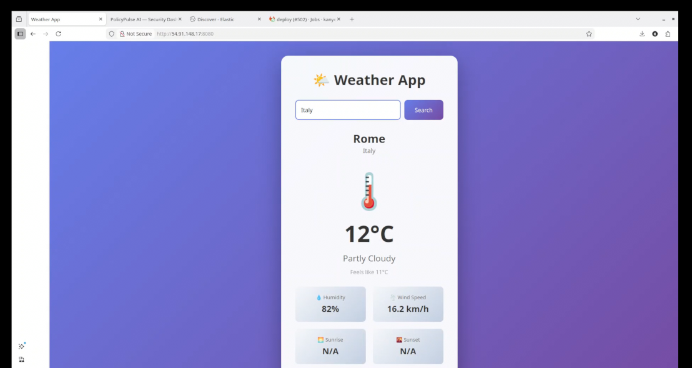

**Figure 19:** *Weather Application Running on Production Server*

# 5. Conclusion

The project yielded several findings with broader applicability to Kubernetes security practice:

1.  Namespace-scoped policy enforcement is essential for production viability. Global enforcement breaks infrastructure components that inherently require elevated privileges.

2.  Fluent Bit grep filters silently fail on nested Kubernetes metadata fields. Tag-based OUTPUT matching is the reliable alternative for namespace-based log filtering.

3.  CronJob-based data exporters effectively bridge the gap between Kubernetes custom resources (PolicyReports) and observability platforms (Elasticsearch).

4.  Shell executor CI runners require upfront tool installation but eliminate per-job container pull overhead, offering predictable pipeline performance.

5.  The \|\| true pattern for kubectl applied in CI/CD enables policy enforcement visibility without delivery pipeline interruption.

6.  LLM APIs can generate useful security recommendations from Kubernetes cluster data, but output quality scales with input data richness.

## 5.2 Future Work

Several enhancements would strengthen the platform for production readiness:

-   Multi-node cluster deployment: Migrate from Minikube to a kubeadm or managed Kubernetes cluster (EKS, GKE) for realistic production topology.

-   Elasticsearch RBAC: Enable X-Pack Security with role-based access control for log data, creating read-only viewer and administrative roles.

-   Network policies: Implement Kubernetes NetworkPolicy resources to restrict inter-pod communication per the zero-trust networking model.

-   GitOps adoption: Replace imperative kubectl apply with ArgoCD or Flux for declarative, Git-reconciled cluster state management.

-   Elastic IP: Assign a static AWS Elastic IP to the production instance to eliminate manual IP updates.

# 

# 

# 

# 5. References

1.  Aqua Security (2024). Trivy: A Simple and Comprehensive Vulnerability Scanner for Containers. Available at: https://trivy.dev/

2.  ARMO (2024) Kubescape: Kubernetes Security Platform. https://kubescape.io/

3.  Cloud Native Computing Foundation (2024). Kubernetes 500

4.  Documentation. https://kubernetes.io/docs/

5.  DeepSeek (2024). DeepSeek API Documentation. https://platform.deepseek.com/api-docs

6.  Elastic (2024) Kibana Guide \[8.12\]: https://www.elastic.co/guide/en/kibana/8.12/

7.  Fluent Bit (2024). Fluent Bit Official Documentation. https://docs.fluentbit.io/

8.  Kikuchi, D. (2024). Collect Kubernetes Logs with FluentBit, Elasticsearch, and Kibana. Medium.https://medium.com/@kikuchidaisuke.zr/collect-kubernetes-logs-with-fluentbit-elasticsearch-and-kibana-e7e97cc77928

9.  Kyverno Project (2024) Kyverno: Kubernetes Native Policy Management. Available at: https://kyverno.io/docs/

10. MITRE(2024) ATT&CK for Containers. https://attack.mitre.org/matrices/enterprise/containers/

11. National Security Agency (2022) Kubernetes Hardening Guide https://media.defense.gov/2022/Aug/29/2003066362/-1/-

12. Red Hat (2024) State of Kubernetes Security Report 2024https://www.redhat.com/en/resources/state-kubernetes-security-report
